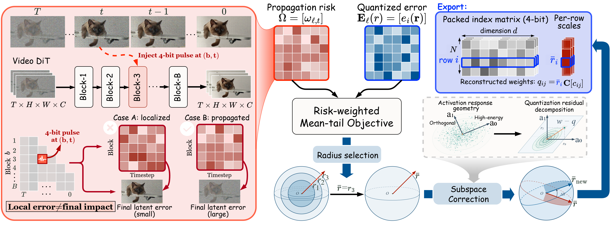
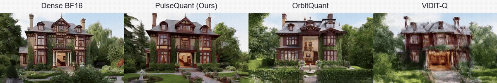
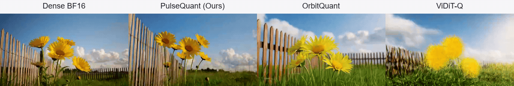
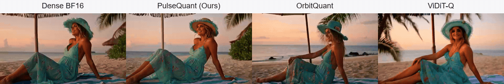

# PulseQuant

**Propagation-Guided Subspace Correction for 4-Bit Video Diffusion Transformers**

<p align="center">
  <a href="https://yutongwang1012.github.io/PulseQuant/"></a>
  <a href="https://arxiv.org/abs/2609.33384"></a>
  <a href="https://huggingface.co/yutongwang1012/PulseQuant"></a>
  <a href="#quick-start"></a>
  <a href="LICENSE"></a>
</p>

TLDR: PulseQuant is a post-training quantization method for video diffusion transformers.
This repository provides W4A4 and W4A6 calibration and inference for Wan 2.1,
Wan 2.2, MiniMax-H3, and Self Forcing.

## Introduction

PulseQuant combines denoising trajectory sensitivity with activation geometry.
It first measures how quantization errors propagate across denoising steps, then
uses these measurements to calibrate weight scales. A second stage refines weight
codes along dominant activation directions to preserve model responses.



*Figure. PulseQuant combines propagation-guided radius calibration with response-subspace correction.*

### Highlights

- **Propagation-guided calibration:** prioritize trajectory states where quantization errors have greater downstream impact.
- **Response-subspace correction:** refine neighboring weight codes using activation-informed directions.
- **Multiple models and precisions:** support bidirectional and autoregressive video generation with 4-bit weights and 4- or 6-bit activations.

## Gallery

MiniMax-H3 comparisons. Left to right: **Dense BF16**, **PulseQuant (Ours)**,
**OrbitQuant**, and **ViDiT-Q**. See more qualitative comparisons on [our webpage](https://yutongwang1012.github.io/PulseQuant/).

### W4A4

**Victorian house**



<details>
<summary>View full prompt</summary>

3D model of a 1800s Victorian house, standing tall and grand amidst a lush green garden. The house features a slate roof with intricate chimney pots and ornate bay windows. It has a symmetrical facade with columns supporting a portico entrance. The exterior is painted a deep burgundy color with golden accents. The windows are adorned with intricate ironwork and stained glass depicting floral patterns. Ivy climbs up the walls, intertwining with ivy-covered railings. A cobblestone path leads to the front door, lined with flower boxes filled with vibrant flowers. Inside, the foyer opens to a spacious living room with high ceilings, ornate chandeliers hanging from the ceiling, and richly carved wooden floors. The walls are adorned with oil paintings of historical figures and landscapes. A grand staircase with marble railings rises to the second floor, leading to bedrooms and a library. The house stands proudly in the midst of well-tended gardens, with a small pond and a statue of a knight guarding the entrance. The overall scene exudes elegance and charm, capturing the essence of the Victorian era. Medium shot interior view with focus on the grand foyer and detailed architectural elements.

</details>


**Yellow flowers**



<details>
<summary>View full prompt</summary>

Yellow flowers gently swaying in the breeze, their vibrant petals dancing with each gentle gust. The flowers are large and daisy-like, with soft yellow centers surrounded by feathery yellow petals. They sway gracefully in a field of green grass, with a slight breeze blowing from the right side. The sky is a clear, sunny blue, with fluffy white clouds floating lazily across the horizon. A small wooden fence frames the scene, adding a touch of rustic charm. The sun casts a warm glow over everything, creating a peaceful and serene atmosphere. Soft, natural lighting fills the frame, highlighting the beauty of the flowers and the lush green surroundings. The composition is balanced, with the flowers at the center, the fence on the left, and the sky and clouds on the right. The focus is on the movement of the flowers, captured with smooth, fluid camera movements. Medium shot, low-angle view.

</details>


### W4A6

**Beach at sunset**



<details>
<summary>View full prompt</summary>

Beachside scene captured during sunset, featuring a young woman with sun-kissed skin and tousled sandy blonde hair. She is wearing a flowing, turquoise-colored sundress with delicate floral patterns and a matching wide-brimmed straw hat adorned with a small flower. Her expressive brown eyes are framed by long lashes, and she has a serene yet playful smile. She is lounging on a plush, striped towel, positioned under a large umbrella providing shade. A calm ocean breeze rustles the palm leaves nearby. In the background, a picturesque coral reef can be seen reflecting the warm hues of the setting sun. The sky is painted with soft shades of orange and pink, blending seamlessly into the deep blue of the horizon. Soft, dreamy lighting and gentle waves create a tranquil atmosphere. The scene captures the essence of a leisurely summer day at the beach. Medium shot, half-body portrait, with focus on the woman's joyful expression and the serene environment. Gentle camera movement following the woman as she enjoys the moment.

</details>


**Office scene**


<details>
<summary>View full prompt</summary>

Office interior scene captured in high-definition, a professional office worker typing on a laptop computer at their desk. The worker is a middle-aged woman with shoulder-length brown hair tied up in a neat ponytail. She is wearing a tailored grey business suit with a white blouse underneath, and black leather shoes. Her face shows determination and focus as she concentrates on her work. The background features a cluttered desk with stacks of paperwork, open files, and a coffee mug. The lighting is soft and warm, highlighting the worker's determined expression. The room has a modern and organized aesthetic. Medium shot from the side, capturing the worker's full body.

</details>


## Models and Downloads

Download calibration caches from [Hugging Face](https://huggingface.co/yutongwang1012/PulseQuant/tree/main)
and prepare the corresponding original model checkpoints.

| Model | Precision | Cache directory | Scripts |
|---|---|---|---|
| Wan 2.1-1.3B | W4A4 / W4A6 | `wan2.1_t2v_1.3b/` | [wan21_1_3b](models/wan21_1_3b) |
| Wan 2.1-14B | W4A4 / W4A6 | `wan2.1_t2v_14b/` | [wan21_14b](models/wan21_14b) |
| Wan 2.2-A14B | W4A4 / W4A6 | `wan2.2_t2v_a14b/` | [wan22_a14b](models/wan22_a14b) |
| MiniMax-H3 | W4A4 / W4A6 | `minimax_h3/` | [minimax_h3](models/minimax_h3) |
| Self Forcing | W4A4 / W4A6 | Calibrated during generation | [self_forcing](models/self_forcing) |

Each cache directory contains `w4a4/pulsequant.pt` and `w4a6/pulsequant.pt`.
Wan 2.1 and Wan 2.2 load weights and the tokenizer from the original model
directory; T5 and VAE configurations are included in this repository.


## Quick Start

### Installation

Run from the repository root on Linux:

```bash
conda env create -f environment.yml
conda activate pulsequant
python -m pip install flash-attn --no-build-isolation
```

The environment includes Triton, and `third_party/` contains bundled dependencies.
For Self Forcing, follow the [Python 3.10 dependency setup](models/self_forcing/README.md).

### Wan 2.1 / Wan 2.2

Set `MODEL` to the original model directory and `CACHE` to its PulseQuant cache.
`PROMPTS` points to a text file with one prompt per line, for example:

```text
A turtle swimming underwater.
A cat walking through a garden.
A sunset over the ocean.
```

Each selected prompt generates one video. The command below uses `LIMIT=2` to
select the first two prompts and generate two videos. Set `OFFSET` to a zero-baseds
starting index; for example, `OFFSET=1 LIMIT=2` selects the second and third prompts.
Pass `4` for **W4A4** or `6` for **W4A6**.

```bash
MODEL=/path/to/Wan2.1-T2V-1.3B \
CACHE=/path/to/pulsequant.pt \
PROMPTS=/path/to/prompts.txt \
LIMIT=2 \
bash models/wan21_1_3b/infer.sh 4
```

For Wan 2.1-14B or Wan 2.2-A14B, use `models/wan21_14b/infer.sh` or
`models/wan22_a14b/infer.sh` with the matching model and cache.

### MiniMax-H3

Create a JSON manifest, using a unique filename stem for each `name`:

```json
[
  {"name": "example_000", "prompt": "A person walks through a garden.", "seed": 42}
]
```

```bash
MODEL=/path/to/MiniMax-H3 \
CACHE=/path/to/pulsequant.pt \
MANIFEST=/path/to/manifest.json \
CUDA_DEVICES=0 \
bash models/minimax_h3/infer.sh 4
```

Set `CUDA_DEVICES=0,1` to split text encoding and DiT across two GPUs.

### Self Forcing

```bash
SELF_WAN_MODEL_ROOT=/path/to/Wan2.1-T2V-1.3B \
CHECKPOINT=/path/to/self_forcing_dmd.pt \
PROMPTS=/path/to/prompts.txt \
CUDA_DEVICE=0 LIMIT=2 \
bash models/self_forcing/calibrate_and_infer.sh 4
```

Self Forcing calibrates the model and generates videos in the same run.

### Run settings

`LIMIT` sets the prompt count, `OFFSET` the starting index, and `OUT` the output
directory. Runs are saved under `runs/<model>/w4a<activation_bits>/` by default.
The inference scripts use BF16 quantization/dequantization (Q/DQ).
Use [.env.example](.env.example) as a template for local paths.

## Calibration

To create a calibration cache, run:

```bash
MODEL=/path/to/Wan2.1-T2V-1.3B \
bash models/wan21_1_3b/calibrate.sh 4
```

For other models, use `models/wan21_14b/calibrate.sh`,
`models/wan22_a14b/calibrate.sh`, or `models/minimax_h3/calibrate.sh` with the
corresponding `MODEL`. Caches are saved to
`runs/<model>/w4a<activation_bits>/cache/pulsequant.pt`. Set `CACHE` to choose a destination.

All models use the same three bundled calibration prompts by default.
`PROMPTS` controls the videos to generate; calibration uses the prompts in
`configs/calibration_prompts/`. Set `CALIB_PROMPTS` to supply a custom calibration file.

## Acknowledgements

We thank the authors of OrbitQuant, Diffusers, Self Forcing, and the supported
video models. 

## Citation

```bibtex
@article{wang2026pulsequant,
  title={PulseQuant: Propagation-Guided Subspace Correction for 4-Bit Video Diffusion Transformers},
  author={Wang, Yutong and Ge, Xingtong and Liu, Enhuai and Wang, Yunke and Xue, Tianfan and Chen, Xinyuan and Xu, Chang},
  journal={arXiv preprint arXiv:2609.33384},
  year={2026}
}
```
